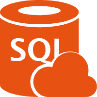

# Trade2SQL



Trade2SQL 是一个高效的数据库表结构转Go结构体工具，旨在简化数据库开发过程中的模型定义工作。它能够自动连接到数据库，分析表结构，并生成对应的Go语言结构体定义，大大提高开发效率。

## 📋 功能特点

- **多数据库支持**：兼容MySQL、PostgreSQL和SQLite等主流数据库
- **智能类型映射**：自动将数据库字段类型映射为合适的Go类型
- **可空字段处理**：正确处理NULL值，转换为指针类型
- **自定义标签**：支持生成json、db、gorm等多种格式的结构体标签
- **主键识别**：自动识别并标记表的主键字段
- **字段注释**：保留数据库中的字段注释到Go结构体中
- **图形界面**：提供直观的GUI界面，无需记忆复杂命令
- **命令行支持**：同时支持命令行模式，方便集成到自动化流程
- **跨平台**：支持macOS、Windows和Linux等多种操作系统

## 🖼️ 界面预览


## 🚀 安装指南

### 方法一：直接下载

从[Releases](https://github.com/suhualin/trade2sql/releases)页面下载预编译的应用程序。

### 方法二：从源码构建

#### 前置条件

- Go 1.18或更高版本
- 安装了Fyne工具包
  
##### 安装依赖
```
make deps
```
##### 构建应用
```
make build
```
##### 打包为应用程序（可选）
```
make package
```
#### 构建步骤

1. 克隆仓库

```bash
git clone https://github.com/suhualin/trade2sql.git
cd trade2sql
```

## 🛠️ 开发者指南
### 项目结构
```
trade2sql/
├── assets/                 # 资源文件
├── cmd/                    # 命令行入口
│   ├── package/            # 打包命令
│   └── trade2sql/          # 主程序入口
├── internal/               # 内部包
│   ├── config/             # 配置管理
│   ├── db/                 # 数据库连接
│   ├── generator/          # 结构体生成
│   ├── gui/                # 图形界面
│   └── resources/          # 嵌入资源
├── models/                 # 生成的模型示例
├── pkg/                    # 公共包
│   └── build/              # 构建工具
├── scripts/                # 脚本文件
├── .gitignore              # Git忽略文件
├── config.yaml             # 配置文件
├── go.mod                  # Go模块定义
├── go.sum                  # Go依赖校验
├── LICENSE                 # 许可证
├── Makefile                # 构建脚本
└── README.md               # 项目说明

```
## 📄 许可证
MIT License

## 🤝 贡献指南
1. Fork 项目
2. 创建特性分支 ( git checkout -b feature/amazing-feature )
3. 提交更改 ( git commit -m 'Add some amazing feature' )
4. 推送到分支 ( git push origin feature/amazing-feature )
5. 创建Pull Request
## 📞 联系方式
如有问题或建议，请提交Issue或联系项目维护者。


